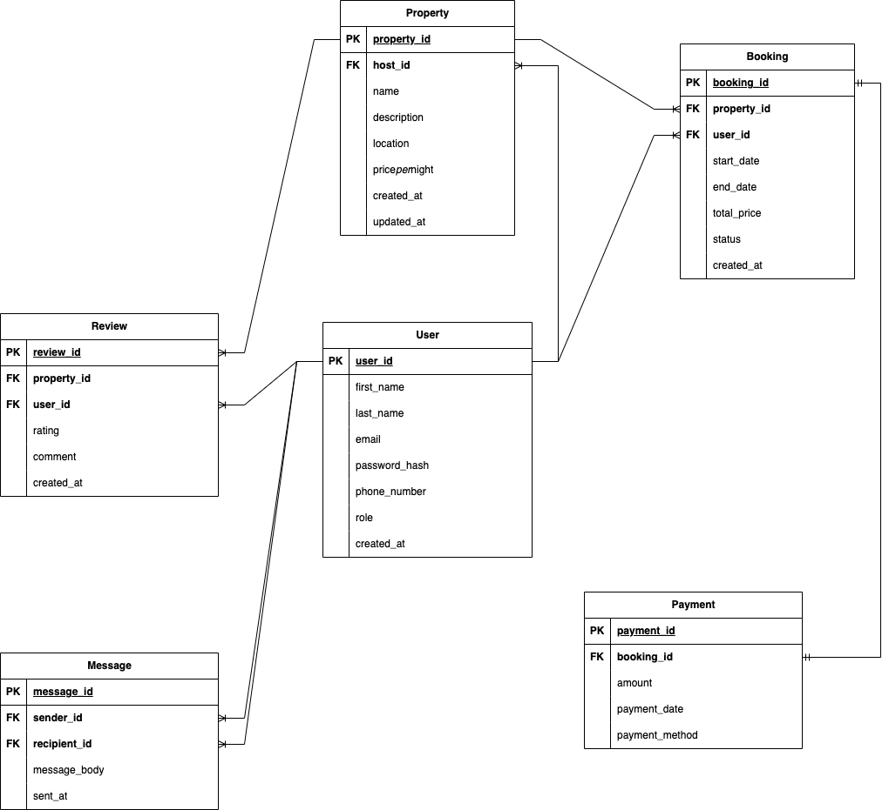

# Entity-Relationship (ER) Diagram for Airbnb Clone Database

## Overview

This ERD visualizes the core entities and relationships based on the Airbnb database schema.

## Diagram

## Entities and Relationships

- A User (host) can create many Properties
- A User (guest) can make many Bookings.
- A Property can be booked many times.
- A Booking can have one Payment.
- A User (guest) can leave many Reviews.
- A Property can have many Reviews.
- A User can send many Messages.
- A User can recieve many Messages.
